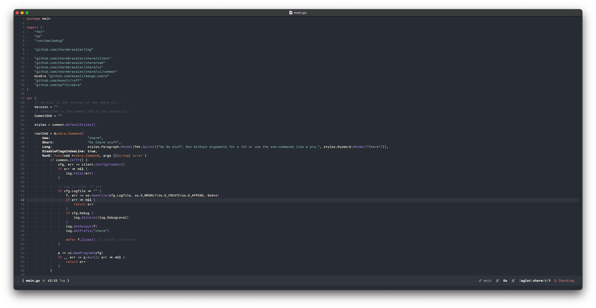

# anisochromatic-emacs
A port of [Anisochromatic](https://github.com/isomatter-labs/anisochromatic) to Emacs.

(Code in screenshot is taken from [Charm](https://github.com/charmbracelet/charm))

## Why?
Anisochromatic is a colorscheme created with the primary purpose of being readable,
pleasant, and mildly retro, while maintaining the color attributes used by
GitHub's code viewer.
(The one exception to this rule is string literals, which have been migrated from
blue to teal, since many common colorschemes use green for string literals, and this
seemed to be a happy medium.)

This is done to reduce mental overhead when looking back and forth between one's editor and
code on GitHub.

Inspiration is taken from the following colorschemes:
 - [Gruvbox](https://github.com/morhetz/gruvbox)
 - [Nord](https://www.nordtheme.com/)
 - [One Dark](https://github.com/Binaryify/OneDark-Pro)
 - [Github Dark](https://dribbble.com/shots/15487845-GitHub-Dark-mode-colors)
